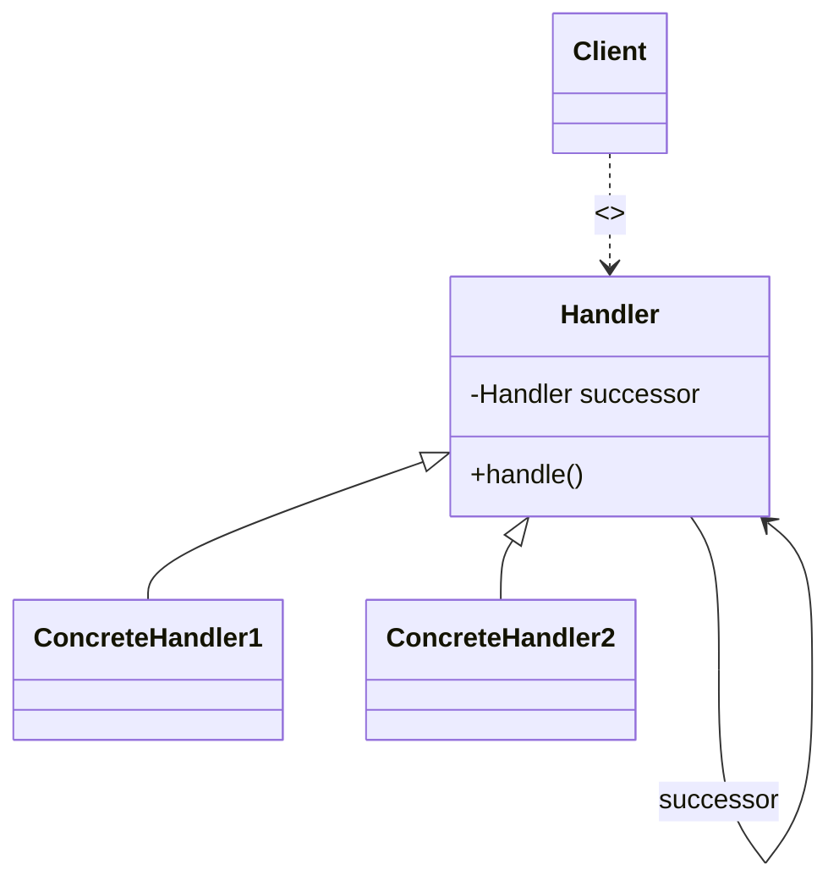

## 责任链
- 解耦请求的发送者与接受者
- 有多个对象可以处理请求,具体哪个运行时决定
- 不明确接收者的情况下,想提交请求
- 处理请求的对象集合可以动态指定

```mermaid
classDiagram
    class Handler {
        -Handler successor
        +handle()
    }
    Handler --> Handler: successor
    class ConcreteHandler1
    class ConcreteHandler2
    Handler <|-- ConcreteHandler1
    Handler <|-- ConcreteHandler2
    class Client
    Client ..> Handler: <<use>>

```
