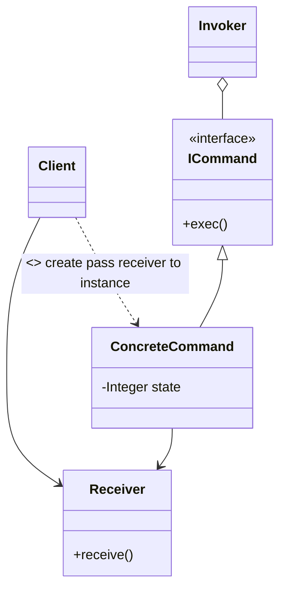

- 将一个请求对象化, 从而实现用不同的请求参数化
- 对请求进行排队
- 请求可撤销

```mermaid
classDiagram
    class ICommand{
        +exec()
    }
    <<interface>> ICommand
    class ConcreteCommand{
        -Integer state
    }
    class Invoker
    class Receiver{
        +receive()
    }
    class Client
    Client ..> ConcreteCommand: <<use>> create pass receiver to instance
    ICommand <|-- ConcreteCommand
    Client --> Receiver
    Invoker o-- ICommand
    ConcreteCommand --> Receiver
```