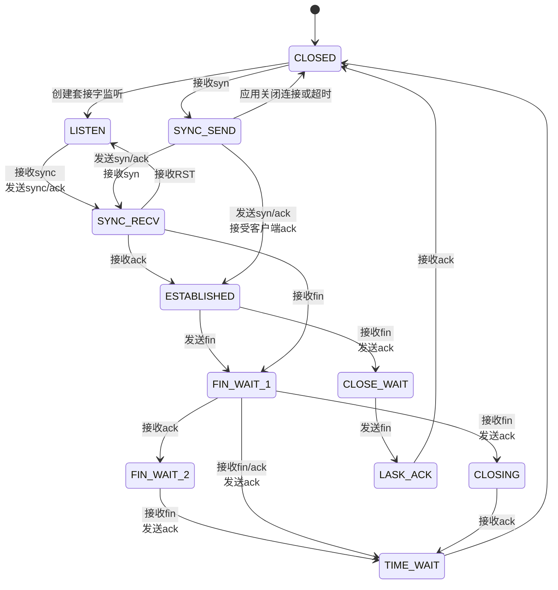

```mermaid
stateDiagram-v2
[*] --> CLOSED
CLOSED --> LISTEN: 创建套接字监听
LISTEN --> SYNC_RECV: 接收sync <div> 发送sync/ack
CLOSED --> SYNC_SEND: 接收syn
SYNC_SEND --> SYNC_RECV: 发送syn/ack <div> 接收syn
SYNC_RECV --> LISTEN: 接收RST
SYNC_RECV --> ESTABLISHED: 接收ack
SYNC_SEND --> ESTABLISHED: 发送syn/ack <div> 接受客户端ack
SYNC_SEND --> CLOSED: 应用关闭连接或超时
ESTABLISHED --> FIN_WAIT_1: 发送fin
FIN_WAIT_1 --> FIN_WAIT_2: 接收ack
FIN_WAIT_2 --> TIME_WAIT: 接收fin <div> 发送ack
TIME_WAIT --> CLOSED
FIN_WAIT_1 --> TIME_WAIT: 接收fin/ack <div> 发送ack
FIN_WAIT_1 --> CLOSING: 接收fin <div> 发送ack
CLOSING --> TIME_WAIT: 接收ack
SYNC_RECV --> FIN_WAIT_1: 接收fin
ESTABLISHED --> CLOSE_WAIT: 接收fin <div> 发送ack
CLOSE_WAIT --> LASK_ACK: 发送fin
LASK_ACK --> CLOSED: 接收ack
```